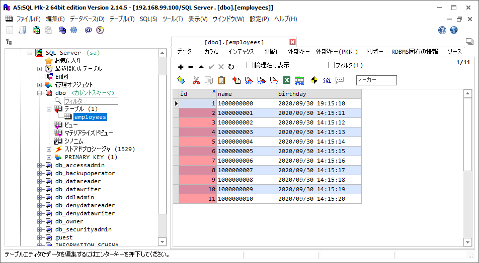

# a5m2 から SQL Server (mssql) への接続設定
a5m2 から SQL Server (mssql) に接続設定をして、接続確認をするまでの手順を説明する。

## SQL Server の準備
SQL Server を手軽に試したい場合は、以下の手順で DB コンテナを用意、起動しておく。

SQL Server コンテナの docker-compose 構成サンプル:  
https://github.com/fs5013-furi-sutao/mssql.server.linux

## 接続設定手順
a5m2 を開く。

サイドバーから「データベース」を右クリックして、メニューから「データベースの追加と削除」を選択する。


「データベースの追加と削除」ウィンドウが開いたら、「追加」ボタンをクリック。


「接続タイプの選択」ウィンドウでは、「Microsoft SQL Server」を選択。

接続設定には以下のように環境に合わせて値を登録していく。


接続設定例:
```yaml
接続タイプ: SQL Server
サーバー名: 192.168.99.100
ポート番号: 1433
認証方法: SQL Server 認証を使用する
ユーザーID: sa
パスワード: msSqlserver123
データベース名: EmployeeDb
```

設定値があっているか一度、「テスト接続」ボタンを押す。うまく接続できれば、「接続に成功しました」ダイアログが表示される。


リネームで DB の接続設定の名前を変えることもできる。以下の例では、「192.168.99.100」か「192.168.99.100/SQL Server」に変更している。


これで SQL Server に接続して、テーブルのレコードを見れるようになった。

おわり。


